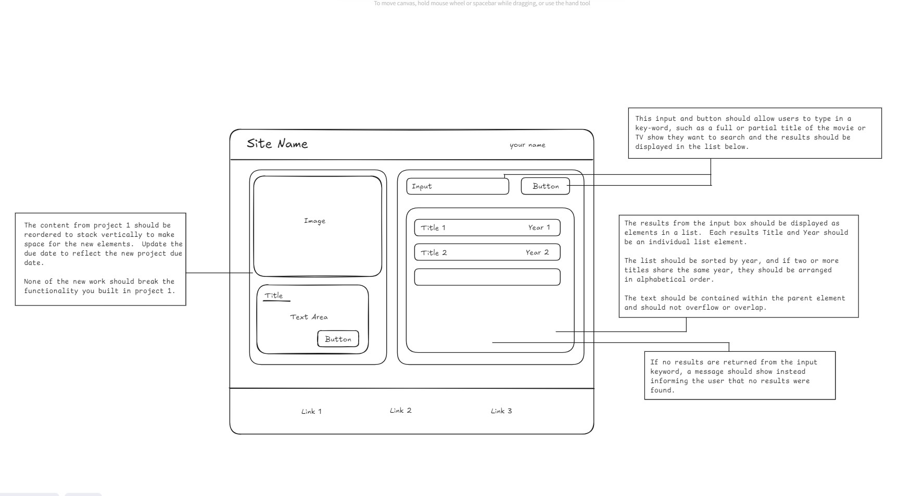

# JavaScript Project 2

The second JavaScript project is an extension on the first with the intention of continuing to
expand upon the core fundamentals of web development.

This project will include fetching and displaying data from a public API using an API key, the creation
of DOM elements, applying sorting logic to groups of objects, and additional styling updates that focus
on spacing and alignment, to name a few.

## The wire frame:

## A few considerations for this project

- The API key that will be required to use the API should not be exposed in the same script file where the
  API call is made. Additionally, the API key should not be checked into source control so a .gitignore will
  need to be implemented.

- Avoid using `positioning: absolute` to space your elements around the page. This type of styling is not
  considered a best practice, so alternative methods should be employed.
