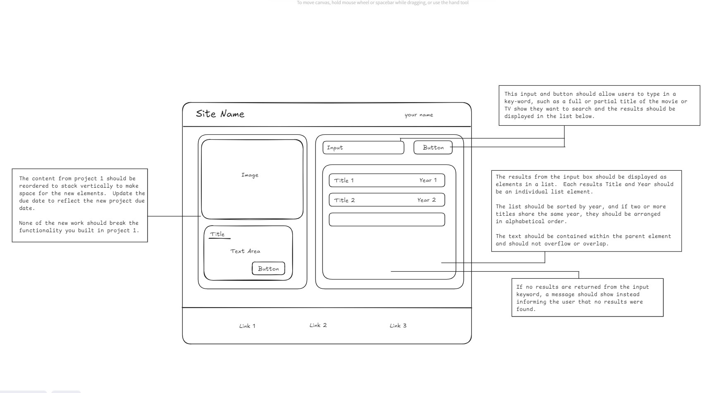

# JavaScript Project 2

The second JavaScript project is an extension on the first with the intention of continuing to
expand upon the core fundamentals of web development.

This project will include fetching and displaying data from a public API using an API key, the creation
of DOM elements, applying sorting logic to groups of objects, and additional styling updates that focus
on spacing and alignment, to name a few.

You will also be working with GitHub to clone the project repository and work on your local machine.
Remember to branch off of the `development` branch and commit your work often. When you complete a significant
milestone in your project requirements, it may be a good idea to open up a pull request that can be reviewed.

**Remember:** This may seem like a ton of new and dense information. Take your time to break it down into
smaller, manageable chunks and try and plan and document your approach before you jump into the code.

Even if you don't complete every single piece of functionality outlined, the time spent researching and
practicing is still valuable and will help you later on!

## The wire frame:

## Project outline and goals:

### Including an input:

Working with user inputs is a common task for web developers. This project requires you to add in an input
element and a button that, whn clicked, will take that user input and use that in the API call.

A user should be able to enter in a keyword into the input, hit the button, and the results should display
below. If there are no results returned, the user should be given a notice that nothing was found.

A user should see at **most** 15 results below. Less is okay, but limit the number displayed.

### The API:

An overview on what an API is: https://developer.mozilla.org/en-US/docs/Glossary/API

The API that you will need to use for this project is the OMDb API: https://www.omdbapi.com/
You will need to read the documentation and acquire an API key. There is a lot to learn and understand
about how to use HTTP methods to fetch data from an API, so don't be afraid to reach out for help.

There are resources out there that would be good to investigate that will allow you to test your
API calls outside of the browser such as Postman: https://www.postman.com/. This tool may already be installed
on your work laptop, but if not, we can work with IT to have that set up.

### Working with the data:

The data that is returned from the API should be sorted based on the `year` that the title was released.
If there are two (or more) titles that were released on the same year, then those titles should be sorted
in alphabetical order. Once the data is properly sorted, both the `title` and `year` should be displayed in a list.  
There should be one `<li></li>` item for each title returned, so feel free to use whichever elements inside that parent
list element to display the actual information.

The content of the list items should not overflow out of their parent container or overlap with one another. Everything
displayed should be contained logically in the parent container.

### Adding in the new elements within the previous project 1 work:

To accommodate the new elements needed for phase 2, you will have to rearrange the work completed in project 1 to the
specifications shown in the wire frame. How you accomplish this is up to you, but read the considerations below regarding
style rules.

The containers for the project 1 content and the new content should align in height and make sense aesthetically.

## A few considerations for this project

- The API key that will be required to use the API should not be exposed in the same script file where the
  API call is made. Additionally, the API key should not be checked into source control so a `.gitignore` will
  need to be implemented.

- Avoid using `positioning: absolute` to space your elements around the page. This type of styling is not
  considered a best practice, so alternative methods should be employed.

# Good Luck!!
